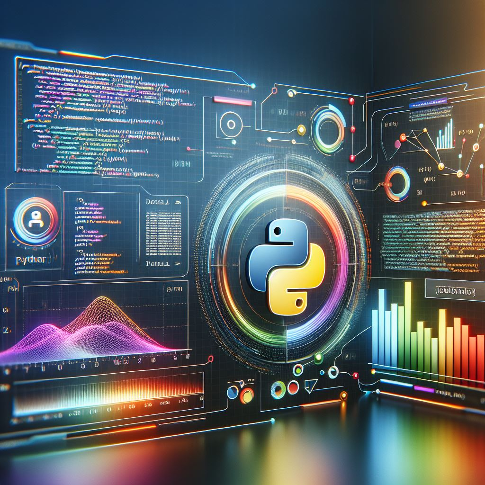

# Base de desarrollo en Python


**Autor:** Frank Michael Posada Barrantes

**Ingeniero electrónico** | Desarrollador de software

**Última actualizacion:** 10/05/2025

---
### 📦 Plantillas y Módulos Base para Desarrollo en Python

Este repositorio contiene una colección organizada de **programas base**, **plantillas**, **módulos reutilizables** y **documentación útil** para acelerar el desarrollo de proyectos en Python.

Su propósito es servir como **kit de inicio personal** para nuevos proyectos, centralizando componentes comunes y buenas prácticas.

---

### 📁 Contenido del Repositorio

- `templates/`
  Plantillas de estructura de proyectos (CLI, scripts, servicios, etc.)

- `modules/`
  Módulos reutilizables: utilidades comunes, manejo de archivos, logging, configuración, etc.

- `docs/`
  Documentación relevante (formato PDF, markdown u otros): guías, referencias rápidas, estándares internos, etc.

- `examples/`
  Scripts de ejemplo para mostrar cómo integrar y usar los módulos y plantillas.

---

### 🛠️ Tecnologías

- Python 3.9.12
- Librerías estándar y externas según corresponda (ver `requirements.txt` si aplica)

---

### 🚀 Uso

1. Clona el repositorio:
   ```bash
   git clone https://github.com/tu-usuario/nombre-del-repo.git

2. Copia lo que necesites para tu nuevo proyecto:
    - Plantillas de proyecto
    - Módulos reutilizables
    - Documentación de referencia

3. Personaliza según tus necesidades.
---
🧠 **Nota**

Este repositorio está pensado para uso personal o interno como base de desarrollo. No es un framework, sino un recurso de productividad para tus propios proyectos.